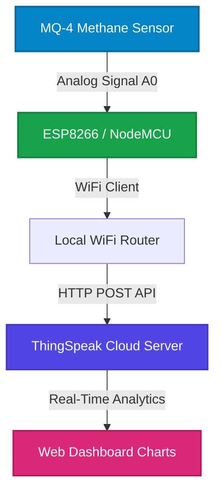
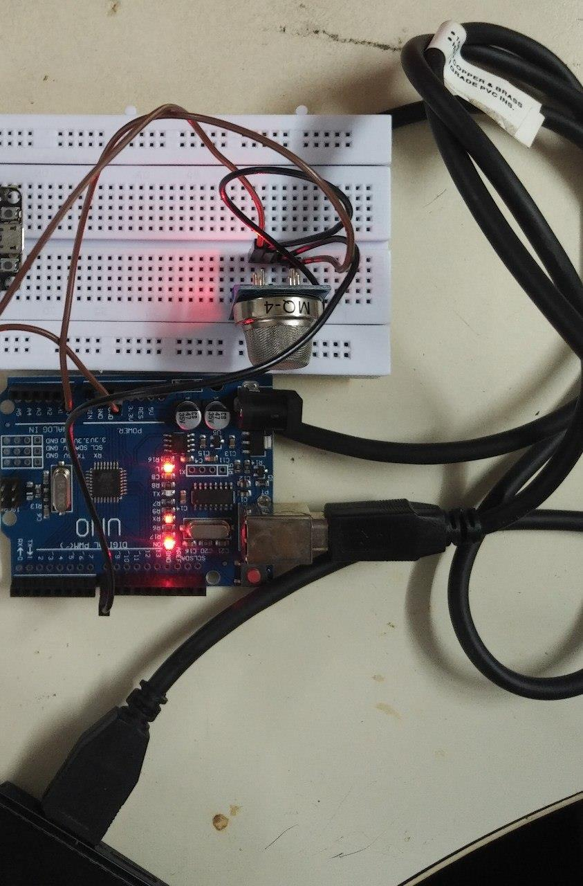
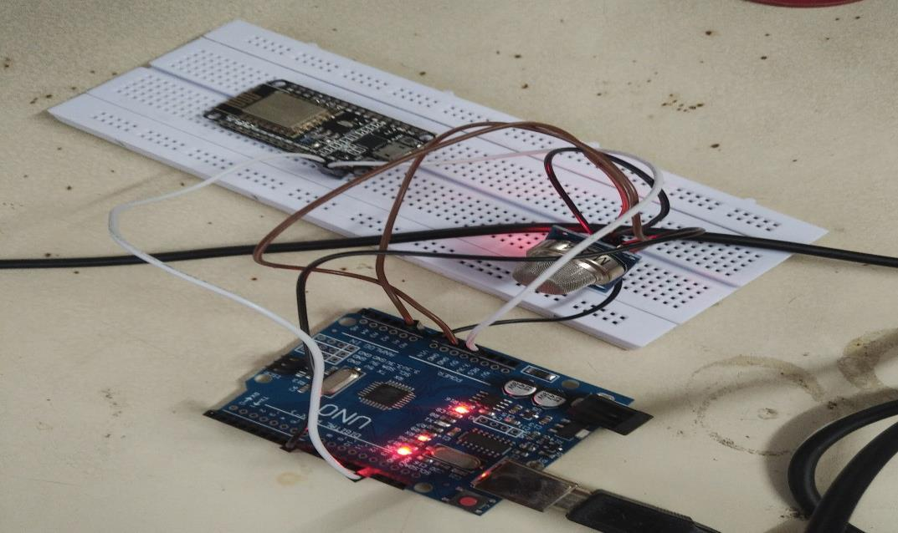
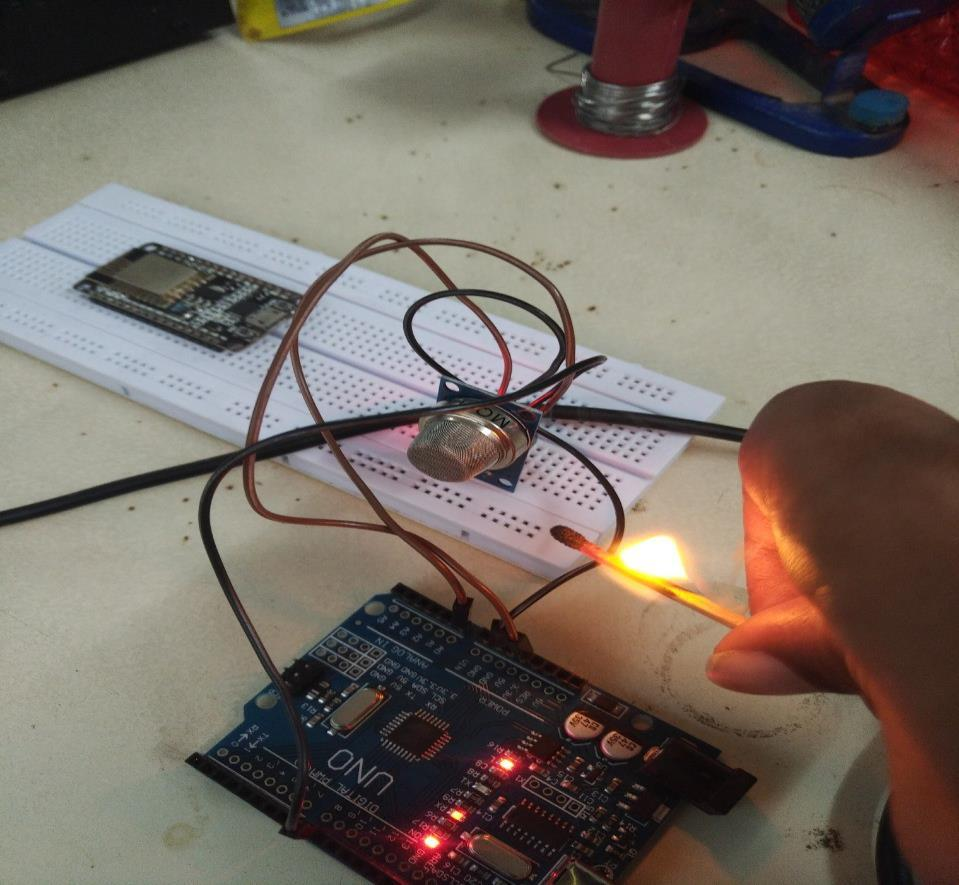
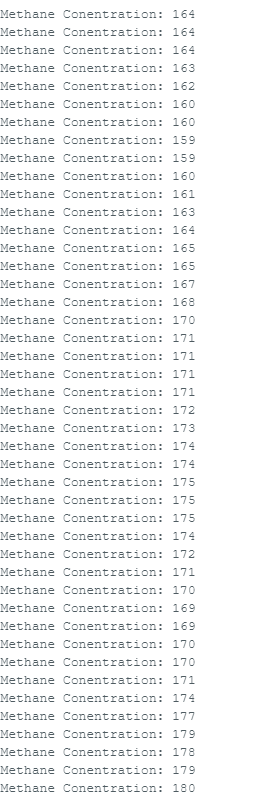

# IoT Methane Gas Monitoring & Alert System

[](https://www.arduino.cc/)
[](https://www.espressif.com/en/products/socs/esp8266)
[](https://thingspeak.com/)

An Internet of Things (IoT) based Methane Gas ($CH_4$) Monitoring System designed to detect gas concentration in residential, industrial, and agricultural settings. The physical prototype continuously measures methane concentration using an analog gas sensor and publishes real-time telemetry data to the **ThingSpeak** cloud platform for remote monitoring.

---

## 📌 Features
- **Real-Time Gas Detection**: Employs the **MQ-4 Metal Oxide Semiconductor (MOS)** sensor to capture methane concentration mapping (ranging from 300 ppm to 10,000 ppm).
- **Wireless Cloud Telemetry**: Leverages the **ESP8266** WiFi module to send periodic data updates to ThingSpeak via HTTP POST requests.
- **Dynamic Data Visualization**: ThingSpeak cloud charts allow historical data tracking and real-time graphs accessible from anywhere.

---

## 🏗️ System Architecture

The diagram below maps the physical prototype implementation:



---

## 🔌 Hardware Components & Pin Connections

### Hardware Bill of Materials (BOM)
| Component | Description | Role |
| :--- | :--- | :--- |
| **NodeMCU (ESP8266)** | WiFi-enabled microcontroller development board | Core processing unit and cloud network gateway |
| **MQ-4 Gas Sensor** | High-sensitivity methane ($CH_4$) gas sensor | Collects analog gas concentration levels |
| **Jumper Wires & Breadboard** | Breadboarding wires | Establishes electrical connections |

### Schematic Interfacing Table
| ESP8266 NodeMCU Pin | MQ-4 Sensor Pin | Description |
| :---: | :---: | :--- |
| **A0** | Analog Output (`A0`) | Passes analog gas voltage levels to ADC |
| **3V3 / VIN** | VCC (`+5V`) | Powers the sensor |
| **GND** | GND | Common reference ground |

---

## 📸 Prototype Gallery

### Physical Prototype Assembly
| Top View | Side View |
|:---:|:---:|
|  |  |

### Active Gas Leak Testing & Output
| Match Test Trigger | Serial Monitor Output Log |
|:---:|:---:|
|  |  |

---

## 💻 Firmware Implementation

The firmware is written in C++ using the Arduino IDE. It initializes the WiFi connection, reads the analog value from the sensor, scales it, and updates ThingSpeak.

```cpp
#include <ESP8266WiFi.h>

// --- Configuration ---
String apiKey = "YOUR_THINGSPEAK_WRITE_API_KEY"; // Replace with your Write API key
const char *ssid = "YOUR_WIFI_SSID";             // Replace with your WiFi SSID
const char *pass = "YOUR_WIFI_PASSWORD";         // Replace with your WiFi Password
const char* server = "api.thingspeak.com";

WiFiClient client;

void setup() {
  Serial.begin(115200);
  delay(10);
  
  // Connect to WiFi
  Serial.println("Connecting to ");
  Serial.println(ssid);
  WiFi.begin(ssid, pass);
  
  while (WiFi.status() != WL_CONNECTED) {
    delay(500);
    Serial.print(".");
  }
  Serial.println("");
  Serial.println("WiFi connected");
}

void loop() {
  // Read analog value from the MQ-4 Sensor on pin A0
  float sensorValue = analogRead(A0);
  
  if (isnan(sensorValue)) {
    Serial.println("Failed to read from MQ-4 sensor!");
    return;
  }
  
  // Calculate percentage mapping (0 to 100%)
  float gasLevelPercentage = (sensorValue / 1023.0) * 100.0;

  // Upload data to ThingSpeak
  if (client.connect(server, 80)) {
    String postStr = apiKey;
    postStr += "&field1=";
    postStr += String(gasLevelPercentage);
    postStr += "\r\n";
    
    // Send HTTP POST headers
    client.print("POST /update HTTP/1.1\n");
    client.print("Host: api.thingspeak.com\n");
    client.print("Connection: close\n");
    client.print("X-THINGSPEAKAPIKEY: " + apiKey + "\n");
    client.print("Content-Type: application/x-www-form-urlencoded\n");
    client.print("Content-Length: ");
    client.print(postStr.length());
    client.print("\n\n");
    client.print(postStr);
    
    Serial.print("Gas Level: ");
    Serial.print(gasLevelPercentage);
    Serial.println("%");
    Serial.println("Data successfully transmitted to ThingSpeak.");
  }
  
  client.stop();
  Serial.println("Waiting for the next transmission cycle...");
  
  // ThingSpeak rate-limits channel updates to once every 15 seconds.
  // delay(15000) keeps the device synchronized with the API limit.
  delay(15000); 
}
```

---

## 🛠️ Step-by-Step Setup Guide

### 1. Hardware Assembly
1. Mount the **NodeMCU (ESP8266)** on the breadboard.
2. Connect the **VCC** and **GND** pins of the **MQ-4 Methane Sensor** to the NodeMCU's power pins (3V3/VIN and GND).
3. Connect the sensor's **A0 pin** to the NodeMCU's **A0 pin**.
4. Power the setup via a USB data cable connected to a computer or power adapter.

### 2. ThingSpeak Configuration
1. Register/Login at [ThingSpeak](https://thingspeak.com/).
2. Create a **New Channel** named "Methane Gas Monitor".
3. Enable **Field 1** and name it `Methane Concentration (%)`.
4. Navigate to the **API Keys** tab and copy the **Write API Key**.
5. Paste this key into the firmware code's `apiKey` variable.

### 3. Flashing the Firmware
1. Open the Arduino IDE.
2. Install the **ESP8266 Board Package** via the Boards Manager: `File` -> `Preferences` -> Additional Boards Manager URLs -> Enter `http://arduino.esp8266.com/stable/package_esp8266com_index.json`.
3. Select your ESP8266 Board (e.g., `NodeMCU 1.0 (ESP-12E Module)`) under `Tools` -> `Board`.
4. Connect the board via USB, select the correct Port, and click **Upload**.
5. Open the Serial Monitor (Baud Rate: **115200**) to see connection updates and real-time gas telemetry printouts.
